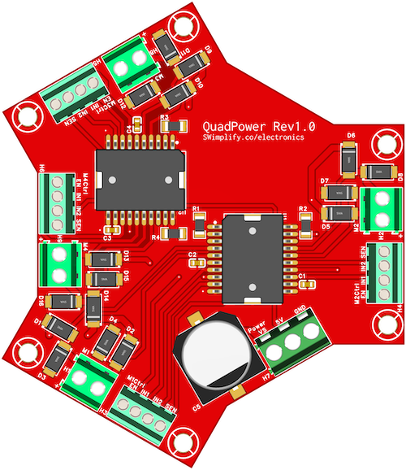
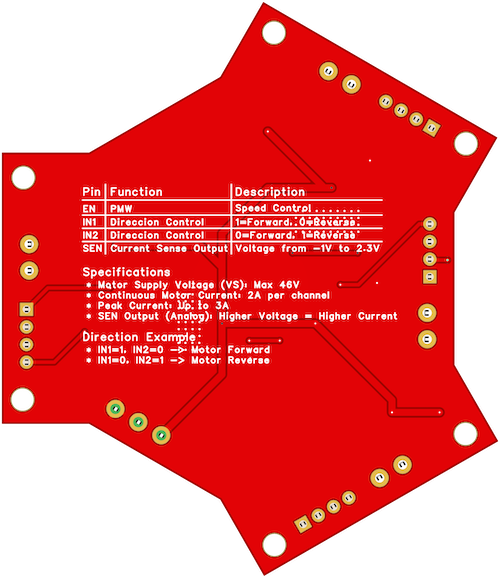

# **QuadPower Motor Driver Board – Full Documentation**  




📌 **Version:** 1.0  
📆 **Last Updated:** February 2025  
📢 **Author:** SWimplify

## **1. Introduction**
🚀 **QuadPower** is a high-performance **4-channel motor driver** designed for **robotics, automation, and industrial applications**. Built around **dual L298P H-Bridge drivers**, it delivers **precise speed, direction, and current monitoring capabilities**. The board is optimized for **high-power applications**, supporting up to **46V motor voltage and 2A continuous current per motor**.

### **Key Features**  
- ✅ **Control up to 4 DC Motors** independently  
- ✅ **Supports Motor Voltages Up to 46V**  
- ✅ **Continuous Current: 2A per Channel (3A Peak)**  
- ✅ **PWM Speed Control & Direction Control**  
- ✅ **Current Sensing Output (-1V to 2.3V)**  
- ✅ **Thermal Shutdown & Flyback Diode Protection**

## **2. Technical Specifications**  

| **Parameter**              | **Specification**                                   |
|----------------------------|-----------------------------------------------------|
| **Motor Voltage (VS)**     | 7V – 46V                                            |
| **Logic Voltage (VSS)**    | 5V (Microcontroller-compatible)                 |
| **Continuous Current**     | 2A per channel                                      |
| **Peak Current**           | 3A (short pulses)                                   |
| **PWM Frequency**          | 0 – 100% Duty Cycle (Up to 20kHz)                   |
| **Direction Control**      | Logic IN1/IN2 (1-0 = Forward, 0-1 = Reverse)        |
| **Current Sensing Output** | -1V to 2.3V Analog Output (Proportional to current) |
| **Motor Channels**         | Flyback Diodes                                      |
| **Protection**             | 4 Independent Outputs                               |
| **Connector Type**         | Screw Terminals & Header Pins                       |
| **Board Size**             | Compact & Space-Efficient                           |

## **3. Board Layout & Pinout**  

### **Pin Descriptions**  

| **Pin Name**  | **Function**                    | **Description**                             |
|---------------|---------------------------------|---------------------------------------------|
| **VS**        | Motor Power Supply              | 7V – 46V input                              |
| **VSS**       | Logic Voltage                   | 5V (Microcontroller Compatible)             |
| **GND**       | Ground                          | Common Ground                               |
| **M1–M4**     | Motor Outputs                   | Connect DC motors                           |
| **EN1–EN4**   | Enable (PWM Input)              | Controls speed using PWM                    |
| **IN1, IN2**  | Direction Control (Logic)       | Set direction (IN1=1, IN2=0 → Forward)      |
| **SEN1–SEN4** | Current Sensing Output (Analog) | -1V to 2.3V (Proportional to motor current) |

## **4. Wiring & Installation Guide**  

### **Powering the Board**
- Connect **VS** to a power source **(7V – 46V, depending on motor specs)**.  
- Connect **VSS** to **5V** (from microcontroller or external regulator).  
- Ensure all **GND** connections are common.  

### **Connecting a DC Motor**
| **QuadPower Pin** | **Microcontroller Pin** |
|-------------------|-------------------------|
| **M1_EN (PWM)**   | Any PWM-capable pin     |
| **M1_IN1**        | Digital Output (1/0)    |
| **M1_IN2**        | Digital Output (1/0)    |

## **5. Control Logic & Operation**  

### **Motor Control Table**
| **EN (PWM)** | **IN1** | **IN2** | **Motor Direction** |
|--------------|---------|---------|---------------------|
| PWM Signal   | 1       | 0       | Forward             |
| PWM Signal   | 0       | 1       | Reverse             |
| 0 (LOW)      | X       | X       | Motor OFF           |

- **PWM adjusts motor speed**  
- **IN1 & IN2 determine direction**  

## **6. Current Sensing & Monitoring**  

Each motor has a **SEN (Current Sense Output)** that provides an **analog voltage (-1V to 2.3V)** proportional to motor current.

#### **Using an ADC to Monitor Current (Arduino Example)**  

```cpp
#define SENSE_PIN A0  // Analog pin for current sensing

void setup() {
  Serial.begin(9600);
}

void loop() {
  float voltage = analogRead(SENSE_PIN) * (5.0 / 1023.0); // Convert ADC to voltage
  Serial.print("Current Sense Voltage: ");
  Serial.println(voltage);
  delay(500);
}
```

## **7. Sample Code (Arduino)**

```cpp
#define M1_EN 5   // PWM pin
#define M1_IN1 6  // Direction pin 1
#define M1_IN2 7  // Direction pin 2

void setup() {
  pinMode(M1_EN, OUTPUT);
  pinMode(M1_IN1, OUTPUT);
  pinMode(M1_IN2, OUTPUT);
}

void loop() {
  digitalWrite(M1_IN1, HIGH);
  digitalWrite(M1_IN2, LOW);
  analogWrite(M1_EN, 128); // 50% speed
  delay(2000);

  digitalWrite(M1_IN1, LOW);
  digitalWrite(M1_IN2, HIGH);
  analogWrite(M1_EN, 128); // 50% speed in reverse
  delay(2000);

  analogWrite(M1_EN, 0); // Stop motor
  delay(1000);
}
```

## **8. Troubleshooting Guide**

| **Issue**                    | **Possible Causes & Solutions**               |
|------------------------------|-----------------------------------------------|
| **Motor not running**        | Check power, enable pin, and direction pins   |
| **Motor spinning wrong way** | Swap IN1 and IN2 connections                  |
| **Overheating or shutdown**  | Reduce motor load or check for short circuits |
| **No current sense output**  | Ensure ADC pin is correctly connected         |

## **9. Best Practices & Safety Tips**

- ✅ **Double-check wiring before powering on.**  
- ✅ **Do not exceed 46V VS or 2A continuous current.**  
- ✅ **Use a heat sink if operating near maximum current limits.**  
- ✅ **Keep away from conductive surfaces to prevent shorts.**

## **10. Additional Resources**

- 📖 Full Documentation & Datasheets: [SWimplify.co/quadpower](https://www.swimplify.co/prduct.php)
- 💬 Support & Community Forum: [SWimplify.co/#contact-us](https://www.swimplify.co/#contact-us)
- 📦 Buy More & Get Discounts: [SWimplify.co/#products](https://www.swimplify.co/#products)
- 🚀 Enjoy building with QuadPower! Need help? [Contact](https://www.swimplify.co/#contact-us) us anytime.